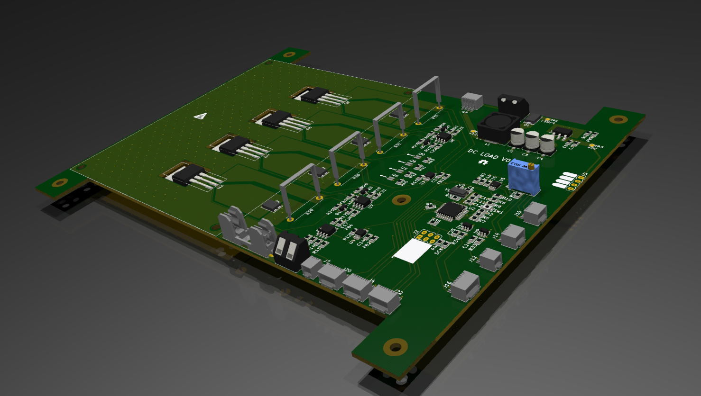
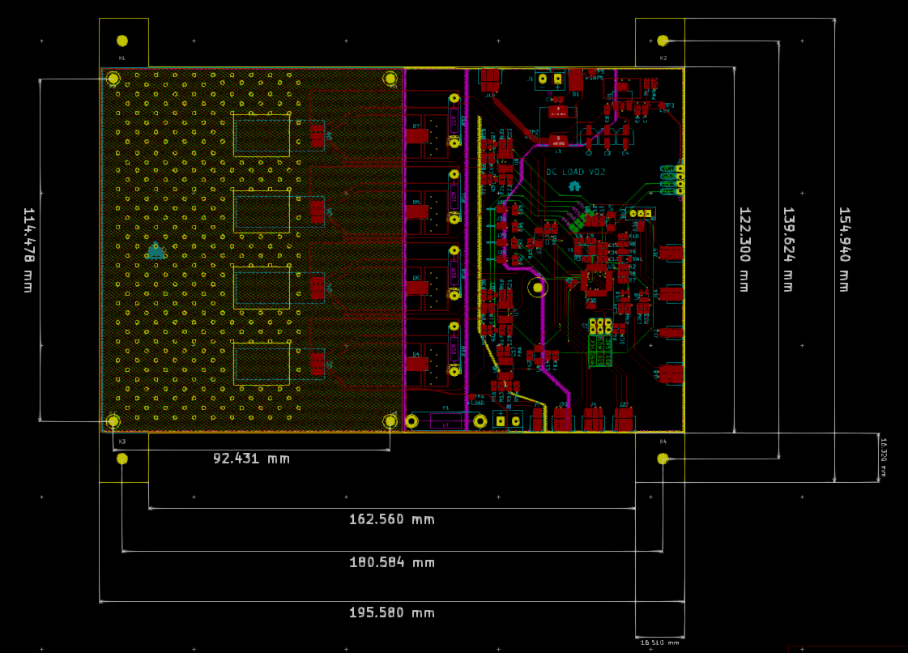

# DC_LOAD_V02

### Summary: ###
  This board is a follow up to the 1A DC_LOAD_V01 prototype. It is a 5A, 30V, 100W constant current load that will be mounted
  in a Jameco project enclosure. It currently isn't finished or tested yet, but feel free to have a look around anyway!
  
  
